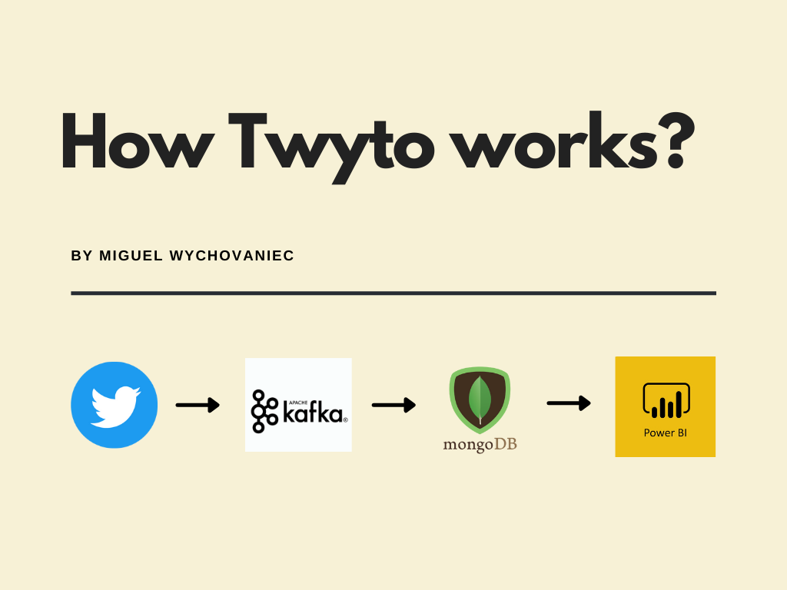

# Twyto
## Big Data Real-time Crypto Analysis
**Data engineering project for crypto currency analysis using twitter API.**  

For this project to work you'll have to configure the following:  
    - **Zookeeper**  
    - **Apache Kafka** 
    - **MongoDb** 
    - **Twitter developer** account (API_KEY, API_SECRET_KEY, ACCESS_TOKEN, ACCESS_TOKEN_SECRET)  

You can specify the ports, servers and other configurations using the **config.py** file. Please note that all parameters are mandatory for this project to work.  

### Data Streaming  

The data is consumed from twitter "tweets" using the twitter API. The code can be found on "producer.py" file.  
 
The libraries used for this section were:  
    - **tweepy**: to easily consume data stream from twitter's API.  
    - **kafka-python**: to create a kafka producer and send the data to the specified kafka topic.  
    
### Data Consuming and Persistency  

In this part, a kafka consumer listens to the specified kafka topic and inserts all messages into a collection inside MongoDb instance. The code can be found on "consumer.py" file.  
 
The libraries used for this section were:  
    - **pymongo**: to easily work with mongodb  
    - **kafka-python**: to create the kafka consumer and listen to the specified topic.  
    
### Running  

- Run zookeeper server
- Run kafka cluster
- Inside "data-consumer" folder run "consumer.py"
- Inside "data-stream" folder run "producer.py"

