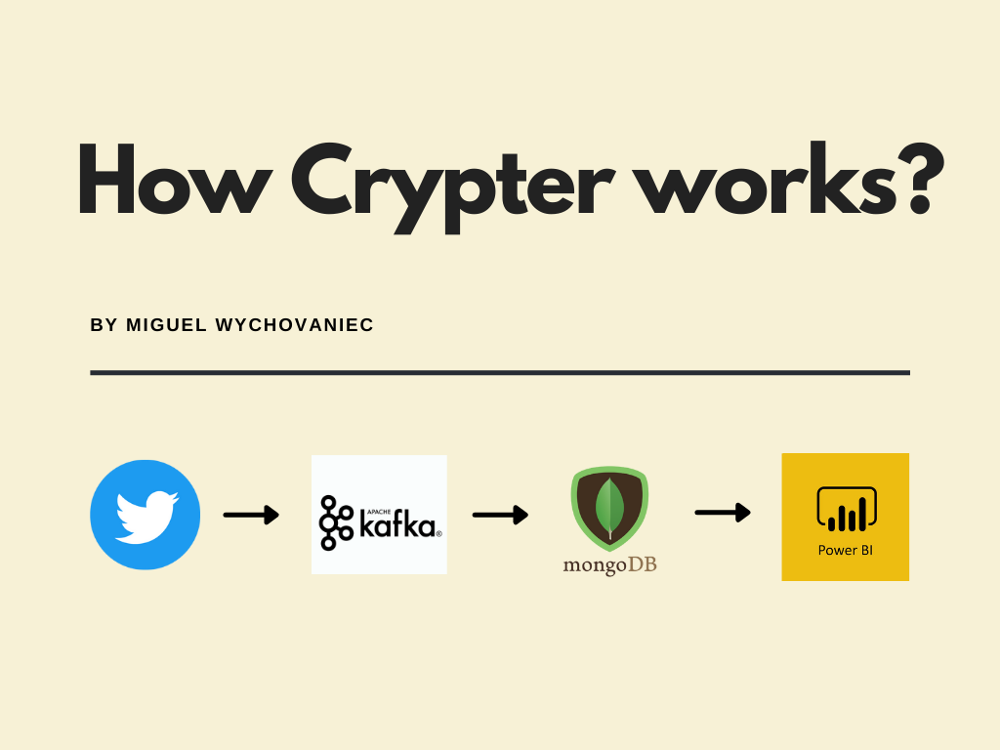

# Twytto
## Big Data Real-time Crypto Analysis
**Data engineering project for crypto currency analysis using twitter API.**  

For this project to work you'll have to configure the following:  
    - **Zookeeper** running on port 2181.  
    - **Apache Kafka** running on port 9092.  
    - Create topic **"crypto"** on apache kafka's cluster.  
    - **MongoDb** instance running on port 27017  
    - **Twitter developer** account (API_KEY, API_SECRET_KEY, ACCESS_TOKEN, ACCESS_TOKEN_SECRET)  

### Data Streaming  

The data is consumed from twitter "tweets" using the twitter API. The code can be found on "producer.py" file.  
 
The libraries used for this section were:  
    - **tweepy**: to easily consume data stream from twitter's API.  
    - **kafka-python**: to create a kafka producer and send the data to "crypto" topic.  
    
### Data Consuming and Persistency  

In this part, a kafka consumer listens to the "crypto" topic and inserts all messages into a collection inside MongoDb instance. The code can be found on "consumer.py" file.  
 
The libraries used for this section were:  
    - **pymongo**: to easily work with mongodb  
    - **kafka-python**: to create the kafka consumer and listen to "crypto" topic.  
